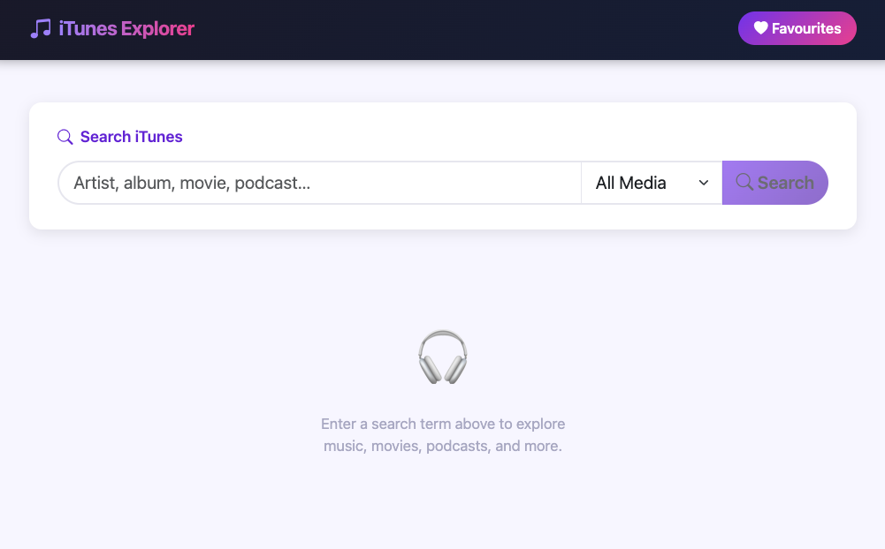

# iTunes Explorer

iTunes Explorer is a full-stack web application for searching the iTunes catalogue. It lets users find music, movies, podcasts, audiobooks, TV shows, and more — and save their favourites for the session.

## Installation

Use npm to install all dependencies.

```bash
npm run install:all
```

## Usage

```bash
# Start the development servers
npm run dev
```

Open **http://localhost:3000** in your browser.

```bash
# Run tests
npm test
```

## Contributing

Pull requests are welcome. For major changes, please open an issue first
to discuss what you would like to change.

Please make sure to update tests as appropriate.

## License

[MIT](https://choosealicense.com/licenses/mit/)


## Example

